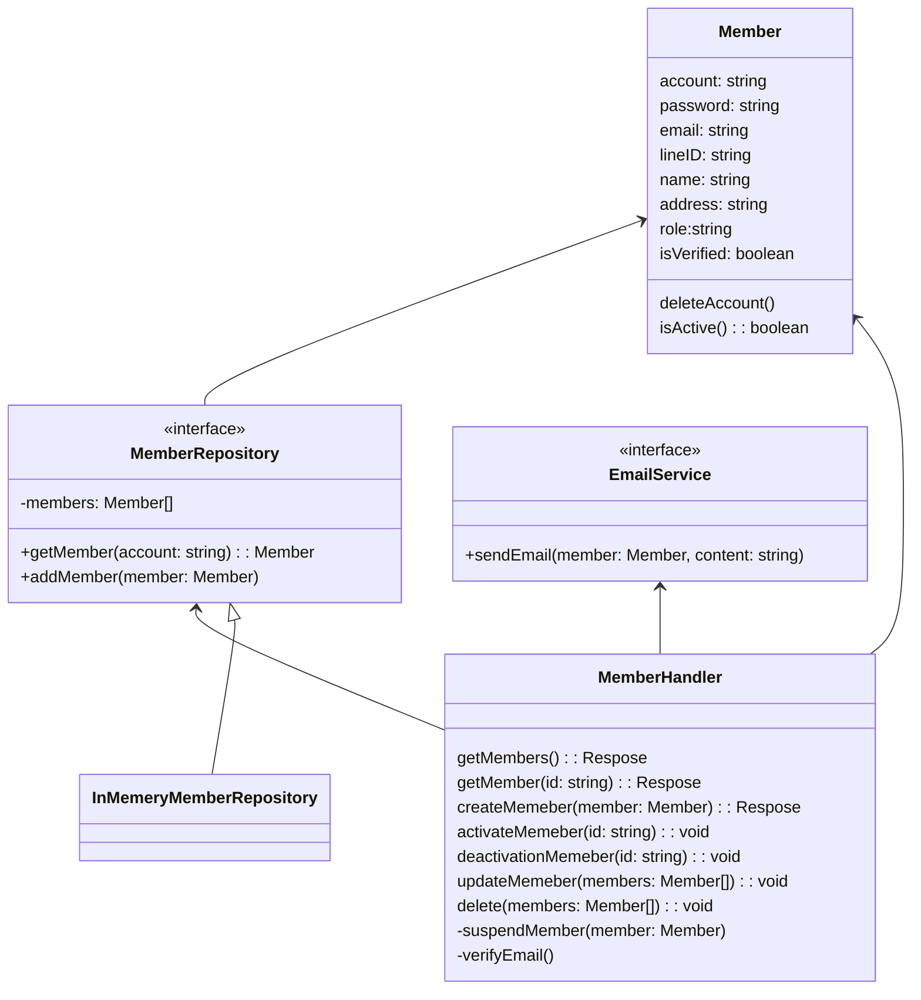

# DDD 練習

語言: javascript
使用CRUD架構

## 需求

- 一個會員管理系統 (Member Management)，裡面有很多會員資訊
  - 會員會有帳號密碼、Email、LineID、姓名、住址
  - 會員需要通過 Email 認證後才能變成正式會員
  - 若是非正式會員，很多操作不能使用
  - 只有會員可以自己決定要刪除帳號
- 你是一名後臺管理員
  - 後臺管理員可以停權某個會員帳號，並且寄送 Email 通知對方
  - 後臺管理員可以對會員寄送 Email，但不能修改他們的基本資訊

## 專案結構

後端分層架構圖 markdown：

- cmd
  - main.ts
- handler
  - member_handler.ts
  - ports
    - member_repository.ts
- model
  - member.ts
- adapter
  - db
    - member_schema.ts
    - member_repository.ts
  - email.ts

### 依賴規則

重要層級：Prototyping

- adapter 依賴 model 與 handler
- adapter 實現 repository
- member_repository 直接使用 model 物件
- handler 層直接與 usecase/service 寫在一起

## API

- GET /members
- GET /members/:id
- POST /members
- POST /members/activate
- POST /members/deactivation
- PUT /members
- DELETE /members
# 2025-ddd-lession
